> 
>
> [幻想星泉](https://space.bilibili.com/149423357/)dalao为我们的《Hear Me》写的同人短篇，感谢授权搬运。
>
> 希望有更多的人能喜欢我们的VSinger们。

## 第一幕 学校大门（00:02\~00:12）

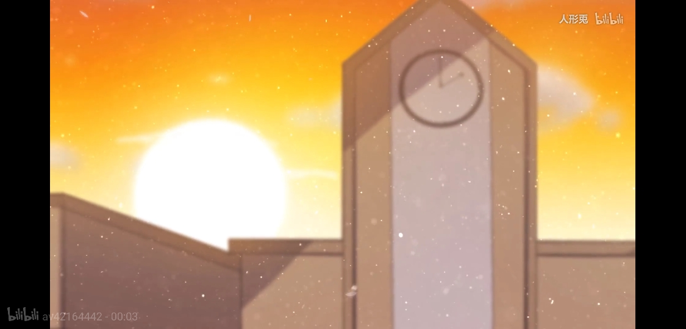

“呼\~为什么照片要我来拍啊QAQ”拿出手机打开相机功能，言和叹了口气。
。。。。。。
昨晚，V家别墅，言和房间。
言和裹了条浴巾从厕所出来，口中还哼着她的代表曲之一的洗澡歌，不过听上去虽然在调上却有气无力。
“一步一条 我蹦蹦跳跳......
哼着小调 又吹着口哨”
突然，房门传来了敲门声。
“咚咚咚”
“嗯？这个时间点谁会来找我？”言和看向房门眨了眨眼。
“阿和，是我”别墅里临近半夜声音还能这么精神的除了乐正绫还能是谁？
“阿绫？”言和思考了绫点一秒是否该放她进来，最后困意促使她说道:“有什么事明天再说吧，我睡觉了”
“诶等等等等等等，我有急事啊！”听出言和话语中的困意，阿绫连忙提高音量说道。
“上次你这么说好像是叫我唱葬歌催眠你睡觉来着，不干”回想上次的事情，言和果断拒绝。
“......”突然一片安静。
“阿绫？”言和疑惑的叫了一声，明明她都想好了其他回绝词的说，而且拒绝一次就放弃可不是阿绫的作风。
“......”还是一片安静。
“看来是走了，明天问问她叫我干嘛好了，至于现在......”
言和打了个哈欠:“还是睡觉吧，拜年祭还要说相声呢......”
就在言和掀开被子准备上床的时候，窗户冒出了一个影子。
“什么东西？”言和拿出手机打开手电筒一照，一个褐发红瞳的少女一脸不怀好意的看着她。
“哇！”言和困意瞬间吓走了一半，手机都差点掉在床上。
“我的乐正大小姐，你到底想干什么啊”
乐正绫敲了敲窗户，示意打开。
言和想也没想的就打开了窗户，结果冻得差点往生。
“**！”她忘了她现在只裹着条浴巾啊！
缩了缩身子，抬头看向从三楼倒立下来的乐正绫说道:“大小姐，这里是二楼耶，而且你这姿势掉下去基本头着地......”
“我知道，谁叫你不开门的，你又在二楼，我只能这样了”乐正绫摊手。
“有话快说”
“OK，我找你是想请你......（省略千八百字）”
就这样，乐正绫说了好几分钟，说得言和都困得感觉不到冷了。
“嗯，差不多就这样了，可以吗？”
“嗯，可以可以”言和连忙答应，对方倒立不晕她还想睡呢，不答应的话天知道会怎么样。（虽然除了开头其他的都没听到）
“谢啦\~”
“所以你现在打算怎么上去？”强忍困意，言和问道。
“不用担心，晚安\~”说完乐正绫就窜了回去。
“晚安......”将窗户关上，言和直接钻进被窝，也没去想乐正绫是怎么回去的，结果直到第二天放学前一堂课乐正绫问起她才知道自己得干嘛。
给五色战队拍做PV用的照片......
不过还好，照片都有要求以及主题，自己只要找角度，把握时机，拍得尽可能自然就行。
第一张就是学校门口，此时夕阳西下，橘红色的阳光让学校显得格外灿烂，唯一美中不足的是学校的钟坏了，时间卡在两点不动了，对于这个言和表示无能为力╮(￣▽￣)╭
由于是要一张学校的特写，所以言和早退五分钟，而且后面还要拍众人出学校的画面，所以没提前多少时间早退。

## 第二幕 学校天台（00:12\~00:22）（续第十四幕）

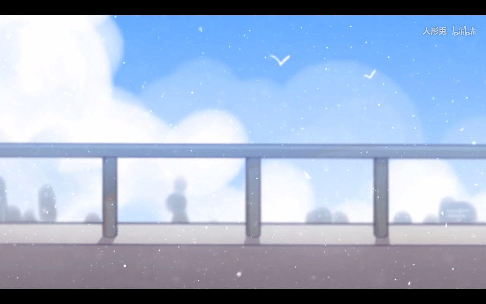

“阿绫居然说不要都是下午的照片，不然显得单调，害得我要浪费休息时间到学校天台，可恶......”
心中诅咒了一遍乐正绫，言和对着天台栏杆拍了几张照。

## 第三幕 洛天依（00:23\~00:25）（续第九幕）

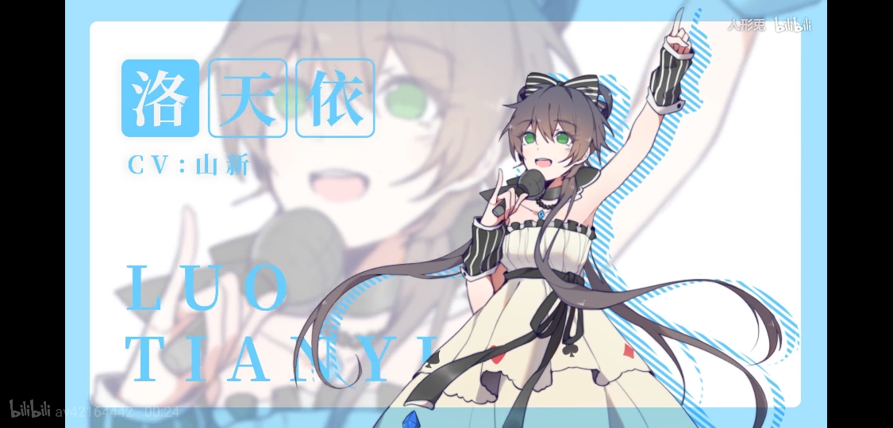

“天依别扭扭捏捏的，拍张照而已”
“可...可是”
“可是什么”
“可是我们已经拍了两百多张照了，每个姿势都试过了，我...不知道该做什么动作了”
“......”
。。。。。。
“阿绫，人物特写照有什么要求的吗？”
“当然有”阿绫伸出食指，一本正经的说道:“自然，越自然越好，毕竟这PV讲述了我们的日常嘛，太生硬就体现不出轻松日常的感觉了”
“哦，好的......”
。。。。。。
没办法，谁让阿绫要求自然呢......可是在摄影棚面对面拍照让人怎么自然......
对了！
“天依你能不能唱一下hear me？”
天依头冒三个问号:“可以啊，可是为什么，我们现在不是在拍照吗？”
“没事，我想听而已”言和没有和天依解释，因为她也想快点结束啊！
歌声响起，很快天依进入了忘我的状态，而作为歌姬唱歌时怎能不跳舞，言和也抓住机会拍了许多照片，后来经过层层筛选才决定用这张图。

## 第四幕 乐正绫（00:25\~00:27）（续第三幕）

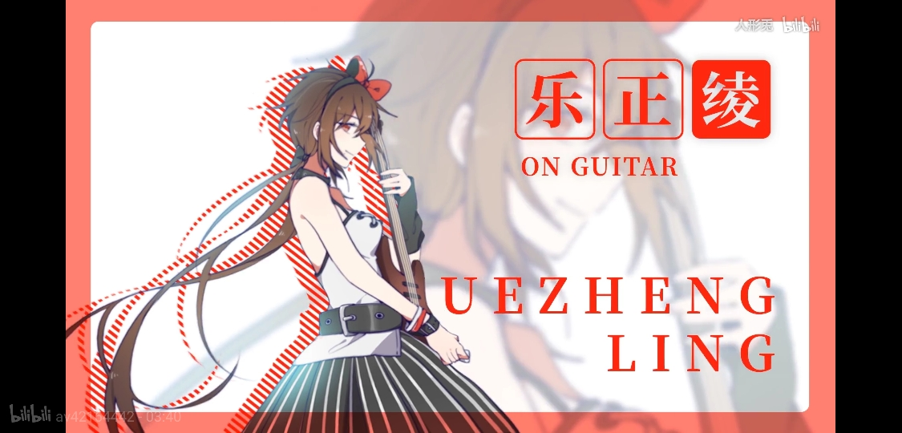

“你说我吉他该怎么拿好看？”阿绫拿着吉他问道，还不断对着镜子摆pose。
“平时怎么拿就怎么拿吧，不是你说的要自然吗？”
“对哦”阿绫一脸恍然大悟。
“......”言和内心默默捂脸。
拍完照后。。。。。。
“为什么你这表情这么像是在勾引粉丝呢”
“因为我有魅力啊，谁让我是超绝可爱乐正绫呢\~”
“......you win”

## 第五幕 徵羽摩柯（00:28\~00:30）（续第四幕）

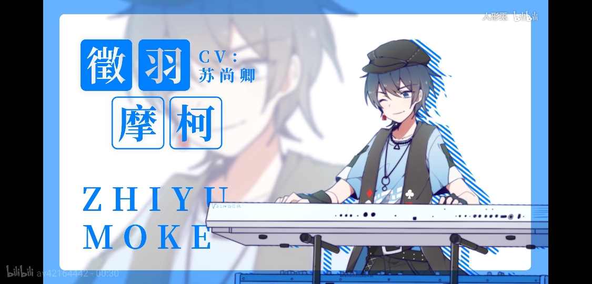

“摩柯，拍特写照了！”
“稍等，打完这局先！”
十分钟后。。。。。。
“徵羽摩柯！”
“来了来了，两分钟！”
又两分钟后，言和面无表情的进了摩柯房间。。。。。。
“victory！”
“yes！”摩柯还没来得及高兴，只听身后传来一声轻轻的咳嗽声，顿时让他冒出一身冷汗。
僵硬的转过头，只见言和正面无表情的看着自己，再加上有绝对身高带来的威压加成，摩柯深刻的体会到了什么叫如坠冰窟。
“言姐绕命啊！”

## 第六幕 墨清弦（00:31\~00:33）（续第五幕）

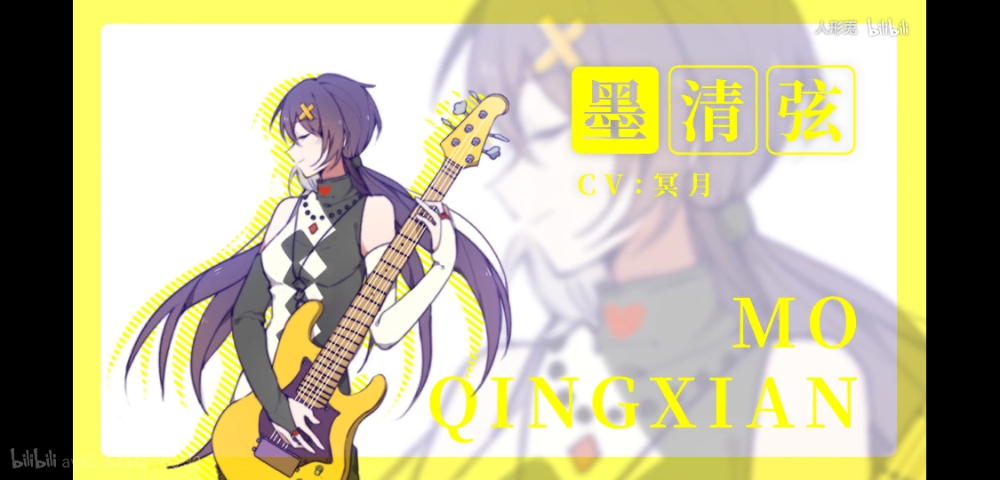

“咔嚓！”
看了一眼刚拍的照片，言和瞬间露出了一脸心累的表情。
“墨姐，能不能放弃小黄子”
小黄子，墨姐最喜欢的猫之一，对就是那个七灵石上过演唱会的，拍之前她问言和能不能让她抱着小黄子，言和想了想:“不就是只猫嘛”就同意了，然而谁也没想到这家伙今天根本安静不下来，搞得每张照片都有一块模糊的地方，多次下来就算言和脾气贼好不会生气也不代表她不会心累。
（摩柯:“......”）
看到言和这样，知道原因的她也只能让小黄子先到一边去了。
没有了捣乱的存在，接下来的过程无比顺利。
“终于成功了”看了看屏幕里的照片，言和十分满意，突然一声花瓶碎裂的声音响起，言和看去，然后脸色瞬间变得苍白起来，整个人都要哭了。
“我的薄荷......”
没错，言和的薄荷盆栽被小黄子打破了，看着一脸无辜的犯人，不，犯猫，言和一咬牙，整个人如饿狼捕食般冲了出去。
“我和你拼了！！！”
。。。。。。
半小时后，天依吃晚饭经过墨姐房间，不知为何听到了言和的声音。
“嗯哼\~墨姐，痛......”
天依:“？？？”

## 第七幕 乐正龙牙（00:33\~00:35）（续第六幕）

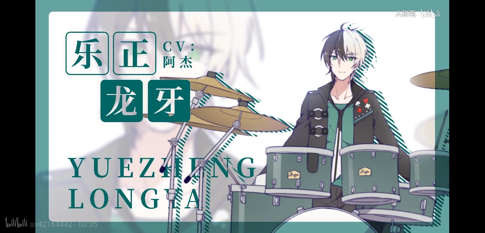

“喂！龙牙吗？”
“干嘛，我快要开会了”龙牙说道，可以清晰的听出来他的呼吸声，可想而知是偷偷接的电话。
“这两天有空吗，拍个特写照给你们做新曲PV”
龙牙正准备说话，只听一个雄厚的男声响起:“总裁，该开会了”
“我知道了”龙牙回道，然后对言和说了一句:“我尽量”后就挂了。
听着电话的嘟嘟音，言和叹了口气，龙牙太忙了，自己还打电话打扰他。。
身体一倒，整个人躺在练歌房沙发上，脑中想到:“晚上应该是不可能拍照的了，从他的话听起来应该明天也一样”
“我该怎么办呢......”这样想着，突然觉得眼皮沉重了不少，于是缓缓的闭上双眼。
。。。。。。
别墅三楼，乐正绫房间。
乐正绫坐在窗边，手中拿着一杯黑咖啡散发着淡淡的蒸汽，时不时的移到唇边抿一下，看着外面的别墅大门，似乎在等待什么。
“呜…...哇\~"一个伸懒腰的声音打破了房间的寂静。
“你还不睡啊？”
“等我家老哥”乐正绫说道。
“哦…有吃的吗？”
乐正绫手指房间角落桌子上的肉夹馍:“在那里，变态辣的”
“你想辣死我吗，要是着火了我可是会赖在这里的”
“真的吗！”乐正绫笑道。
“......”
见对方没了下文，乐正绫抿了一口咖啡:“辣一下提神醒脑好陪陪我呗，大半夜好无聊的”
“行，来瓶可乐呗”
“没问题\~”
。。。。。。
深夜两点半，一辆奔驰停在别墅前，过了好几分钟后车门打开，一位黑白发各半的青年一脸睡眼惺忪的下了车。
“辛苦你了”
“龙总哪里话”
“晚安”
将车门关上，龙牙蹑手蹑脚的进了铁门，然后又进了大门，生怕吵醒别墅的任何一人，殊不知这全都被三楼的两小只尽收眼中。
“去喽～”
“早点回来，明天还要上学呢”
“OK！”
。。。。。。
一近大门，一处光亮引起龙牙注意。
“这几只又忘了把练歌房灯关掉”龙牙没好气的心中暗道。
走近准备把灯关掉，在关之前下意识的看了一眼房内，结果看到了一双雪白的赤足从沙发上悬着。
龙牙走近一看，是言和，看着她的睡相龙牙忍不住笑了起来，同时拿出了手机对着她的脸拍了张照。
“想不到言和睡觉也会流哈喇子，这可是不亚于外星人存在的大发现啊！”
“哥你干啥呢？”乐正绫说道，吓得龙牙手一抖，手机直接掉到言和的脸上。
“糟糕！相册还没退出来！”龙牙暗道不妙，准备拿手机的时候发现手机顺着言和的脸滑到了耳旁，偏偏这时言和睁开了双眼，两人一时四目相对。
“牙哥，你怎么......”
龙牙打断言和的话，生怕她说些奇怪的台词:“我看你在练歌房睡着了，想叫醒你回房间的”
“啊？练歌房？”言和有些懵逼。
“对啊阿和，你怎么在这里睡着了”乐正绫靠过来说道。
言和摸了摸头，睡前的记忆如潮水般涌入大脑。
“对了对了！照片！牙哥，拍张照片吧，做你们的新曲PV”
“好的诶阿和，你的脸怎么和弄得跟木乃伊似的”龙牙一脸蒙逼的看着言和，话说牙哥你现在才发现吗。。。。。。
“憋说了”言和摇摇头，一脸欲哭无泪。

## 第八幕 练歌房（00:36\~00:38）（续第九幕）

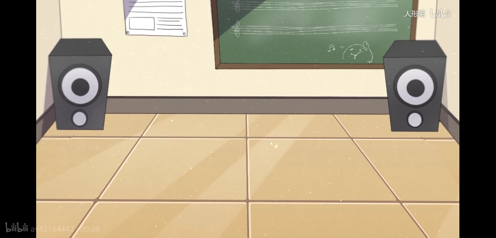

放学后，言和回到V家别墅后第一时间来到练歌房门口。
“第三张场景图就是练歌房了，应该是最没难度的一张了，早拍早结束吧！”
言和推门而入并开了灯，结果眼前的一幕差点让她吐血。
“洛天依你用过的碗筷能收一下吗！？”
结果言和花了十几分钟将练歌房打扫了一遍才开始拍照。

## 第八点五幕 黑板staff表（00:38\~00:43）

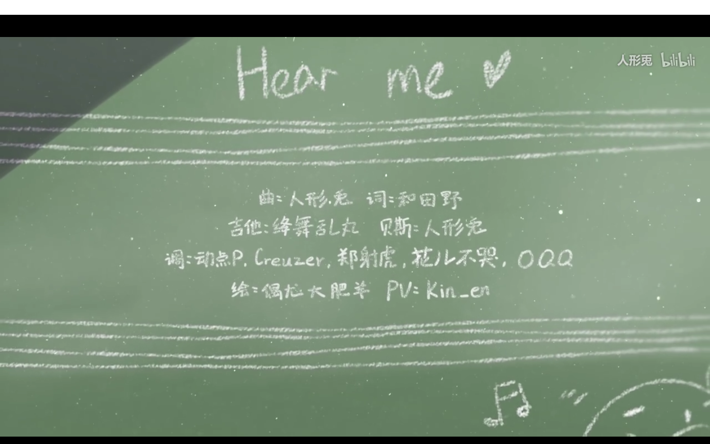

## 第九幕 天依和阿绫一起放学走出学校（00:43\~01:04）（续第一幕）

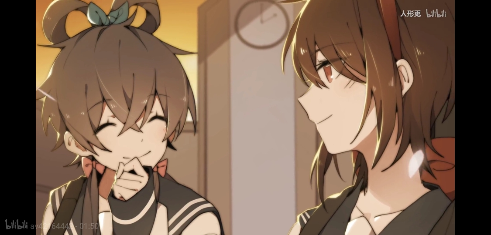

拍完学校的照片后，学生们也从学校出来，一个个脸上带着疲倦。
没多久一个与众不同的灰色身影出现在校门口，旁边一起的还有一个略高一点的身影。
“来了来了！”言和连忙举起手机拍照，快门声连连响起，引起一些路人注意。
“诶你看那个男的在干嘛啊”
“当然是拍照了”
“有什么用？”
“当然是......（省略）”
言和听得差点平地摔，网络上说自己像男的就罢了，现实中还这样真的是......于是一把将头上的假发取下，对着两路人说道:“喂喂，我是女的啊”
两路人看着言和雪白的短发，好像意识到了什么而屏住了呼吸，言和也意识到了什么，连忙假发一戴，然后慌不择路的夺路而逃，至于照片，刚才拍了这么多应该可以了，逃命要紧啊！
结果这照片是其中唯一一张好的，还是最后一刻才发现的，阿绫都差点要对言和做些什么事了。

## 第十幕 摩墨龙学校天台（01:05\~01:24）（续第二幕）

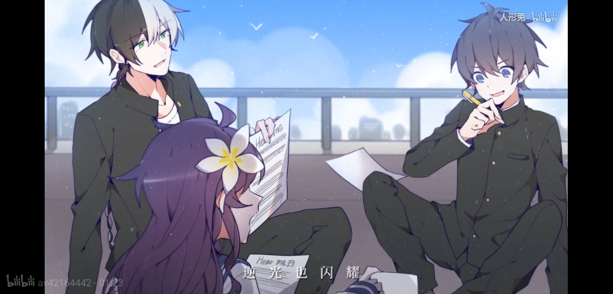

言和正准备离开天台，突然耳边隐隐传来他人说话的声音。
“绫姐说了，歌曲高潮前我们每个人都有十秒的乐器solo时间，我趁老师不注意已经写了一半了”
熟悉的少年音，是摩柯！
“我已经写好了，你们看看怎么样”
更成熟的男声，居然是隔壁大学的龙牙。
“你们两个好快”过了一会儿，一个女生的声音响起，不用想墨姐无疑了，从对话来看似乎是在写歌？
蹑手蹑脚的走过去，生怕让他们听到（言和:“不对我干嘛要这样......”）言和绕过天台大门，三只围成一圈的场景进入视线，由于聊得过于投入所以没发现言和。
看了一会，言和猛然想到这一幕似乎拿来做PV很完美，恰好这三人在学校的照片都还没拍。
“天助我也，一定是老天看我太累才帮我一把！”
言和内心热泪盈眶，缓缓地靠近并将手机相机镜头放到最远（这里实在不知道怎么写，手动笑哭）。
按下快门，看了一眼照片后悄然离去，按下快门的时候摩柯恰好正准备继续下笔，而龙哥墨姐正在讨论旋律的事情，都没有发现言和......言和:“总算有一张容易的照片了......”

## 第十三幕 练歌房合影（01:56\~02:35）（续第十幕）

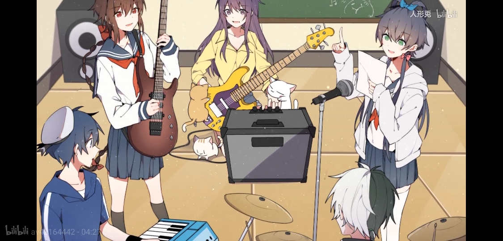

言和:“完成！”
众人纷纷围过来看着手机。
阿绫：“不错哟～”
摩柯：“我在看什么？”
龙牙：“没脸。。。。。。”
天依:“咦？摩柯怎么叼着阿绫的辫子啊”
说完天依还把那部分放大给众人看。
然后摩柯就感觉到了一股杀气，于是拔腿就跑，然而门早已被杀气起源给关上了。
“小摩柯\~\~”阿绫露出了灿烂的笑容。
“绫姐，这是巧合啊！”摩柯连忙解释。
“我知道的，可这并不能妨碍我揉虐你啊”
最终虽然没有像某小说里的龙哥一样进骨科，但被按在沙发上挠痒也是很不好受的，而且还不是阿绫一个人，言和，天依，甚至墨姐也暗中参与了挠脚的环节，龙牙则戴上耳机装死，假装听不到摩柯的求救，没办法，心有余而力不足，救人是要建立在成功率上的，成功率无限接近于零救啥。

## 第十四幕 演唱会台上合影（02:37\~04:23）（续第七幕）

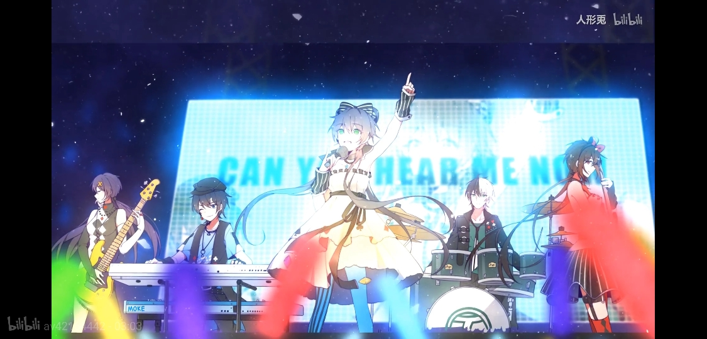

龙哥跑去洗澡睡觉了，叮嘱了阿绫言和两人早点睡就走了。
阿绫:阿和，我记得你拍过演唱会视频吧，拿来给我截个图做PV用的图片。
言和:木有。
阿绫:诶？我记得你当时在台下举着手机啊。
言和:被警察打断了，并要求当场删视频，我删了才让过的。
阿绫:诶？警察不认识你吗？
言和:你忘了，我当时戴着口罩和假发，要是本体下台还不得被粉丝堵住。，而且老V有视频吧。
阿绫:那些远距离的不适合，你当时这么近，效果肯定不错。
言和:等等，你们同台时我好像拍了一张照来着，当初是让我删视频，照片没删”
阿绫:啊啊啊\~言和和\~
言和:打住打住！我去找下。

### 乐器solo部分四人（02:58\~03:08）

* 龙牙（03:08\~03:18）
* 墨姐（03:19\~03:28）
* 摩柯（03:29\~03:39）
* 阿绫（03:39\~03:49）
* 天依solo部分（03:49\~03:53）

天依:诶诶诶，我的solo部分呢？
阿绫:没有啊
天依:纳尼！？
摩柯:没办法，你不会乐器啊
天依一脸QAQ，而阿绫摩柯则检查曲调，过了一会儿墨姐的声音响起。
“我觉得可以给天依一段单人歌词代替solo”
“可solo后就是合唱了”阿绫回道。
“等等”还不等墨姐天依说话，摩柯接过话题:“天依没solo确实不合适，我觉得后面合唱开头两句'去寻找，全世界舞台中央'如其直接合唱到不如给天依solo，毕竟这么有领导力的歌词只有第一位歌姬说出来才更有感觉啊”
“第一位歌姬......”阿绫有些恍惚，对啊，天依是第一位歌姬，哪怕大家都没明说，但天依在大家心中早已是精神领袖般的存在了。
偷偷的看了一眼天依，阿绫嘴角上扬，然后举手说道:“同意”
“我也同意”墨姐举手说道。
就这样，天依的solo部分定下来了，虽然只有几秒，却是这歌不可缺的一部分，至少在摩墨绫心中是这样的。
天依:我是不是该考虑学乐器了。

> (时间顺序:1,9,8,3,4,5,6,7,14,14solo,2,10,13)
>
> 再次感谢[幻想星泉](https://space.bilibili.com/149423357/)dalao
