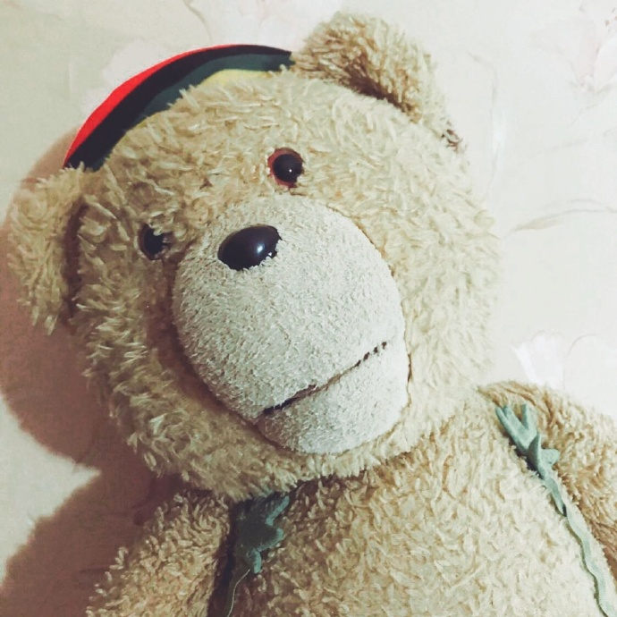

今天推荐的Producer是阿良良木健哦

## 简介

1. 阿良良木健是活跃在acfun和bilibili的一名全能职人，代表作是《元首的日常》系列。自称“Atunemic”，人称“告白P”，于2011年4月在bilibili出道，其十分精良的视频剪辑质量以及幽默而不失严谨的剧情设计使得作品人气十分火爆。

2. 同时，阿良良木健也是一位Vocaloid原创曲作者，擅长电子流行与摇滚曲风。他2012年使用洛天依创作的《末日DISCO》([av415362](http://www.bilibili.com/video/av415362/))和《明日DISCO》([av424616](http://www.bilibili.com/video/av424616/))凭借世界末日话题与一贯高质量荣获著名VC曲的一席之地。除了造成「末日告白墙」的B站弹幕互动奇观，也引来众多P主制作REMIX，更有了“DISCO是第一生产力”的说法，可见其综合实力之高。

3. 曾为动画《尸兄》制作官方角色曲《小小鹿》。

4. 曾出版个人网络EP专辑《恋爱理论:序章》，后于2016年7月15日公开Vocaloid原创中文歌曲专辑《恋爱理论》宣传PV与预订通贩地址等相关资讯。12月26日于微博公开《恋爱理论》小说化~~但是后来鸽了。~~

5. 于2018年6月2日B站关注者突破十万大关，是中文V家里第十一位拥有超过十万粉丝的P主。

6. 2018年11月16日公开Vocaloid原创中文歌曲专辑《奇爱人生》宣传PV与预订通贩地址等相关资讯。

7. 阿良良木健最具代表性的作品是告白三部曲和LOVE SERIES。

8. 目前播放量、收藏数最高的作品都是《绝体绝命》([av21551703](https://www.bilibili.com/video/av21551703/))（截至现在已有172.24万次观看，12.43万人收藏）。

## 杂谈

1. 曾留学于英国学习媒体制作，目前是禾念合作创意者。现实中已脱团，女友名为婧婧。

2. 最早是从MIKU游戏PROJECT DIVA接触V家。

3. 在知乎上把自己黑了一遍： https://www.zhihu.com/question/24446551/

4. 阿良良木健与历历路路曾是搭档关系。

5. 声线是弱气略带磁性的受音。

6. 因《春风来》和后续作品的剧情，给他发「刀片」成了粉丝们最热衷的事情之一。针对这种情况，阿良良木健本人表示，不会改。

7. 曾因《绝体绝命》传说而女装，目前照片已删但你们还可以在贴吧找到。

8. 2018年于Bilibili Macro Link 2018登台演出。

9. 目前阿良良木健的系列曲一共有五个，分别是：
   * 世界DISCO系列：《末日DISCO》([av415362](https://www.bilibili.com/video/av415362/))、《明日DISCO》([av424616](https://www.bilibili.com/video/av424616/))。
   * 告白三部曲：《末日DISCO》([av415362](https://www.bilibili.com/video/av415362/))、《I LOVE U》([av540768](https://www.bilibili.com/video/av540768/))、《心加心》([av4704467](https://www.bilibili.com/video/av4704467/))。
   * 恋爱理论：《I LOVE U》([av540768](https://www.bilibili.com/video/av540768/))、《依存症》([av2687804](https://www.bilibili.com/video/av2687804/))、《二人三角》([av2687815](https://www.bilibili.com/video/av2687815/))、《白夜梦》([av5336375](https://www.bilibili.com/video/av5336375/))、《心加心》([av4704467](https://www.bilibili.com/video/av4704467/))。
   * LOVE SERIES：《春风来》([av11491210](https://www.bilibili.com/video/av11491210/))、《亲爱的》([av12114504](https://www.bilibili.com/video/av12114504/))、《绝体绝命》([av21551703](https://www.bilibili.com/video/av21551703/))、《告别曲》([av36034484](https://www.bilibili.com/video/av36034484/))。

10. 很喜欢的Producer中有一个就是我们的DECO\*27，曾在他的《火花》([av12965661](https://www.bilibili.com/video/av12965661/))中留言：
    > I've been your fans since 2010, your song inspired me so much, and I'm so happy you can join Bilibili and upload your song for us. Anyway thanks for uploading and have fun on Bilibili! (I really hope to make song with you together. Perhaps this could happen someday...)

## 殿堂级/传说级曲目一览

### VOCALOID传说级曲目

* 绝体绝命([av21551703](https://www.bilibili.com/video/av21551703/))
  <iframe frameborder="no" border="0" marginwidth="0" marginheight="0" width=330 height=86 src="//music.163.com/outchain/player?type=2&id=550059604&auto=0&height=66"></iframe>
  

### VOCALOID殿堂级曲目

* 末日DISCO(前文提过的B站末日告白墙，[av415362](https://www.bilibili.com/video/av415362/))

* 明日DISCO([av424616](https://www.bilibili.com/video/av424616/))

* I LOVE U([av540768](https://www.bilibili.com/video/av540768/))

* 小小情歌([av644721](https://www.bilibili.com/video/av644721/))

* CONNECT\~心的连接\~(**强推B站站歌！**[av1231151](https://www.bilibili.com/video/av1231151/))

* 依存症([av2687804](https://www.bilibili.com/video/av2687804/))

* 二人三角([av2687815](https://www.bilibili.com/video/av2687815/))

* 心加心(**强推！**本曲目中阿良良木健特地邀请了各地区的网友投稿情书来参与制作PV，充满了爱情中的感动与热情。[av4704467](https://www.bilibili.com/video/av4704467/))

* 白夜梦([av5336375](https://www.bilibili.com/video/av5336375/))

* 春风来([av11491210](https://www.bilibili.com/video/av11491210/))

* 亲爱的([av12114504](https://www.bilibili.com/video/av12114504/))

* 告别曲([av36034484](https://www.bilibili.com/video/av36034484/))

* 未完成的·乐章([av26637688](https://www.bilibili.com/video/av26637688/))

(内容参考：

* https://zh.moegirl.org/阿良良木健
* https://www.bilibili.com/video/av26243313/

更多信息欢迎大家补充)
