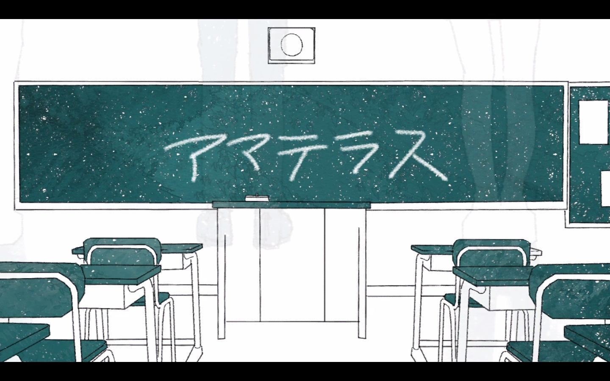
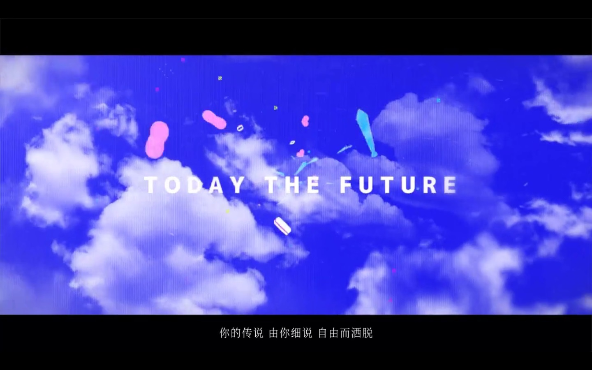

> ~~久 等 了~~
>
> ~~令诸位期待已久的~~VOCALOID推荐栏目终于回归了(不定期更新，有空就更)

今天我们推荐的Producer是曾为Magical Mirai 2017作《TODAY THE FUURE》([av19280713](https://www.bilibili.com/video/av19280713/))的HarryP(针原 翼)哦

HarryP使用的歌姬主要为初音MIKU，有时候也会用镜音RIN等，其曲风以温暖轻快著称，并没有大面积使用电子音的习惯

HarryP的作品数量在整个V领域里面不算少，但我们今天要推荐他的作品有：

* 一闪光 ([av17632876](https://www.bilibili.com/video/av17632876/))
  <iframe frameborder="no" border="0" marginwidth="0" marginheight="0" width=330 height=86 src="//music.163.com/outchain/player?type=2&id=562675543&auto=0&height=66"></iframe>

  

* 天照 ([av18085880](https://www.bilibili.com/video/av18085880/))
  <iframe frameborder="no" border="0" marginwidth="0" marginheight="0" width=330 height=86 src="//music.163.com/outchain/player?type=2&id=562675538&auto=0&height=66"></iframe>

  

* TODAY THE FUTURE ([av19280713](https://www.bilibili.com/video/av19280713/))
  <iframe frameborder="no" border="0" marginwidth="0" marginheight="0" width=330 height=86 src="//music.163.com/outchain/player?type=2&id=562675548&auto=0&height=66"></iframe>

  

~~好吧这个人真的没什么好说的了，事实上我并不知道他有什么特殊的经历~~

(内容参考：

* https://vocaloid.fandom.com/wiki/HarryP

更多信息欢迎大家补充)
