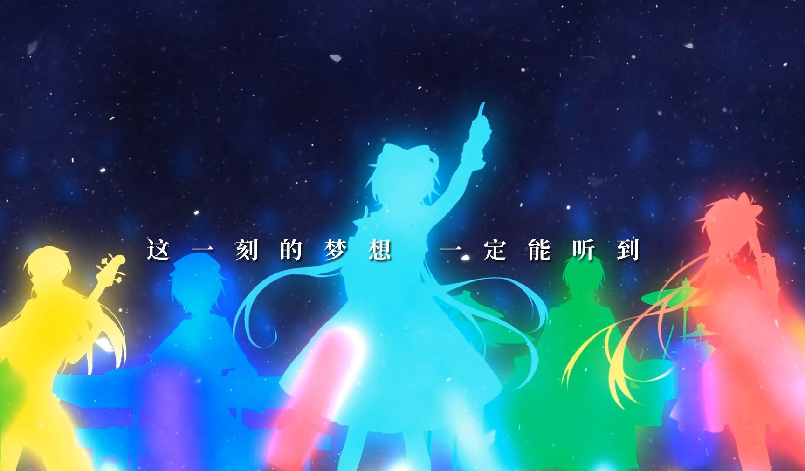

今天推荐的Producer是为我们带来《Hear Me》([av42164442](https://www.bilibili.com/video/av42164442/))的兔总人形兔！

对没错上面那位就是我们的兔总

## 简介

1. **人形兔**是上海禾念信息科技有限公司的音乐总监(这就是为什么我们叫他“兔总”)，实名**潘建**，于2013年入职，并为2015年后上市的所有Vsinger旗下歌手的Vocaloid中文声库（乐正绫、乐正龙牙、徵羽摩柯、墨清弦、洛天依 V4）和星尘声库制作人。

2. 人形兔在担任声库制作的同时也以V家P主的身份进行词曲创作，并在bilibili投稿Vsinger的官方曲目；他在进入V家领域前曾任视觉系金属乐队贝斯手，具备良好的演奏技术，擅长日系摇滚、金属、核类音乐等创作。

3. 人形兔最具代表性的作品是《Scarlet Drop》([av2429316](https://www.bilibili.com/video/av2429316/))和《梦语》([av2523707](https://www.bilibili.com/video/av2523707/))，都是乐正绫的试听曲。

## 杂谈

1. 兔总是早已脱团的人参淫家，偶尔会在微博与未婚妻喵酱投掷闪光弹合影。

2. 喜欢喝酒，乌龟是兔总的常备酒友。

3. 大学为日语专业，同时开始组建乐队并正式开始音乐创作。

4. 声库制作与宣传活动期间重度加班是日常中的日常，但神奇的是，这并没有导致头发的消失。

5. 在禾念工作初期曾为身为同事关系的GhostFinal作词。

6. 自己创作的曲目中最喜欢的是《梦语》([av2523707](https://www.bilibili.com/video/av2523707/))。

7. 在B站创建了个小号名为任性兔，用来发布投了一个就再也没更过的个人娱乐作品。

8. 兔总的系列曲？目前为止不存在的。

## 殿堂级/传说级曲目一览

### VOCALOID传说级曲目

兔总貌似暂时没有传说曲，但是有一首歌，完全有实力成为传说，但由于当时恰逢拜年祭，因此未能达到应有的播放量，那就是我们的

* **Hear Me** ([av42164442](https://www.bilibili.com/video/av42164442/))
  <iframe src="//player.bilibili.com/player.html?aid=42164442&cid=74384601&page=1" scrolling="no" border="0" frameborder="no" framespacing="0" allowfullscreen="true" style="height: 600px; width: 800px;"> </iframe>
  <iframe src="//player.bilibili.com/player.html?aid=42386818&cid=74386264&page=1" scrolling="no" border="0" frameborder="no" framespacing="0" allowfullscreen="true" style="height: 600px; width: 800px;"> </iframe>
  

请允许我破例将其纳入传说曲的行列之中，在我看来这首歌成为VOCALOID神话级曲目也不过分

### VOCALOID殿堂级曲目

* Scarlet Drop (乐正绫试听曲，[av2429316](https://www.bilibili.com/video/av2429316/))

* 梦语 (乐正绫试听曲，[av2523707](https://www.bilibili.com/video/av2523707/))

* 为你而来 ([av4368961](https://www.bilibili.com/video/av4368961/))

* In Your Breath (乐正龙牙试听曲，[av9506196](https://www.bilibili.com/video/av9506196/))

* 卡路里 (cover 火箭少女) ([av28725520](https://www.bilibili.com/video/av28725520/))

* Bloom ([av29648304](https://www.bilibili.com/video/av29648304/))

* 亲爱的安徒生 ([av35032629](https://www.bilibili.com/video/av35032629/))

* 我在 ([av49074585](https://www.bilibili.com/video/av49074585/))

* **Attack!** (VSinger全员出道曲，[av54701738](https://www.bilibili.com/video/av54701738/))

(内容参考：

* https://zh.moegirl.org/人形兔
* https://www.bilibili.com/video/av42252159/

更多信息欢迎大家补充)
