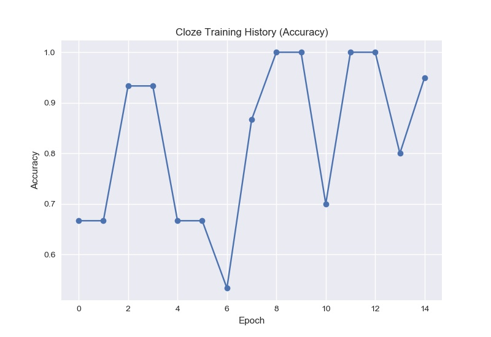
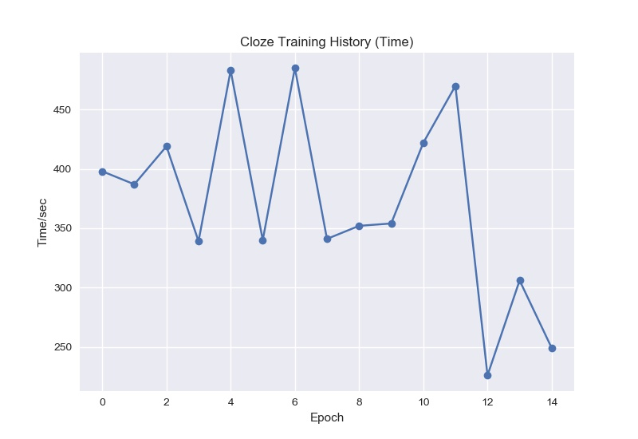

王老师好, 以下是我从这个寒假开始进行英语训练的情况:

## 完形填空

* 正确率 数据可视化
  

* 答题时间 数据可视化
  

* 对应时间与日期:

| Epoch |    Date    |          Section          |
|:---|:----------:|--------------------------:|
| 00 | 2020.01.23 | Page167 A组 Group3 Cloze1 |
| 01 |            |                    Cloze2 |
| 02 | 2020.01.24 | Page168 B组 Group1 Cloze1 |
| 03 |            |                    Cloze2 |
| 04 | 2020.01.25 | Page169 B组 Group2 Cloze1 |
| 05 |            |                    Cloze2 |
| 06 | 2020.01.26 | Page171 B组 Group3 Cloze1 |
| 07 |            |                    Cloze2 |
| 08 | 2020.01.27 | Page172 C组        Cloze1 |
| 09 |            |                    Cloze2 |
| 10 | 2020.01.28 | Page142 A组 Group3 Cloze1 |
| 11 |            |                    Cloze2 |
| 12 | 2020.01.29 | Page144 A组 Group4 Cloze1 |
| 13 |            |                    Cloze2 |
| 14 |            |                    Cloze3 |

## ~~语法填空~~