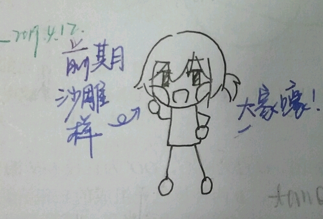

    “没想到他们行动的那么早。那之后的每一步看似顺理成章有惊无险，其实都是迫不得已――多少个不眠夜！”

“哇去！鬼啊――”

惨白的脸――与想象中娇小可爱的女孩形成鲜明对比，巨大的心理落差对言浅生的身心形成了巨大的冲击，他身子猛的抽了一下，不受控制的大叫了一声，向后蹿去。

惨白的脸翻了一个白眼，上前揪住了言浅生的领子，怒道：“谁是鬼！啊！你才是鬼！”

言浅生惊恐的睁大了双眼，看着面前这个身高只到自己下巴、怒气冲冲、捏住自己领子，有着黑色双马尾的惨白的脸――他认出来了――是敷着面膜的箫月白。

“……”

言浅生什么也没说，气氛顿时凝固。

“小白，我说你摘下面膜再开门你不听，你看把言浅生给吓得。”房间里走出一个栗色头发自来卷很重的少女，扎着单团子，似乎憋着笑，是沈泗羡。她的脸看上去水灵灵的，应该是刚刚摘下面膜。

“给男人看自己敷面膜的样子代表对他很信任。”箫月白松了手，一把把面膜从自己脸上拽下来，全然不管面膜的破碎，一下子扔到言浅生脸上，然后撇着嘴退到沈泗羡旁，挎住她的胳膊。

“哎，这说明箫月白对你一点意思也没有，”沈泗羡笑着看着言浅生，“如果是江晚铭，她肯定表现的特矜持。”

“我求您了沈姐姐，给我留点想象空间，”言浅生接住从脸上掉下来的面膜，绕到两人身后进了房间，把面膜扔到垃圾桶就开始洗脸，“我的皮肤可是纯天然的，才不要这些化学物质污染。”

“不识货！好了，别耽误时间，找我们什么事？”箫月白看言浅生大有把自己脸给搓下来的趋势，有些无语。

言浅生甩了甩头，决定让面部自然风干：“对，大河叫咱们班的人去购物中心A座。帮忙叫下三楼的其他人，我们在前院门口集合，快点。”

“购物中心？不能吧？”

言浅生一扭头，发现是班里著名宅男之一――楚寻空，大概是被言浅生的大叫给吸引出来了，此时正探头吃惊的看着自己。

“是购物中心，千真万确。哟，你果然在房间里。怎么，常桥呢？”

常桥和楚寻空是室友，也是宅男。只不过常桥宅二次元，楚寻空真的只是宅而已，在房间里通常在研究一些奇奇怪怪的问题，对数学尤其有兴趣――这导致他和另一个同样热爱数学的同学狄斯澈倒是经常会一起讨论问题。

“百年难遇的出去打篮球了，我给他打电话。”楚寻空缩回房间里去打电话。

言浅生此时看到江晚铭在班群里发的集合消息已经有几个回应的了，三楼剩下的两个伙伴都说马上就到。转头看到箫月白和沈泗羡回房间收拾东西，想了想自己没有什么事，便溜溜达达下楼向前院大门走去。

一路上言浅生看着绽放的百花和蓬勃的新绿透过别墅毫不拘束的落地窗淋漓尽致地映入眼帘，嘴角不禁微微勾起。他又一次想起那了段坐在盘旋而下的楼梯扶手上盯着窗外发呆的日子。那时候的窗外的景象和现在没有什么不同，世间万物仍旧在向阳向上的生长，连气息都是相同的。但实际上，什么都变了，谁也无法触摸到过去。在一呼一吸之间世界缓缓的变化着，慢的让人无法察觉，却决绝的如釜底抽薪。那时候的那时候的他看这个世界是如此朦胧而不知所措的，到如今依旧无动于衷。

而后来的后来，每当他闭上眼，记忆深处染上了时光色调的百花和落叶总是能在不经意间悄悄在脑海里撑开、飘扬。他总是会苦涩的微勾嘴角，他曾以为命运曾经和自己互不相识，谁知命运其实一直在他背后默默蓄力，然后突然一下掀起惊涛骇浪，把他推向不知结局的去处。

“嗨。”

言浅生把流浪的思绪拉回，抬头看到门口已经有了好几位伙伴，正和自己打招呼，便热情的回应。

“哎你说大河为什么让我们去购物中心？”

“谁知道又谋划什么道道呢，我正好想去买点东西。”

伙伴们继续嘁嘁喳喳讨论起来，像一团团火焰，明亮而闪烁。

五分钟后全员终于集齐，在江晚铭的招呼下一行十二个人看似散漫但却快速地向购物中心A座进发，不久便到了A座楼下的小广场。四处望去并没有看到大河的身影，队伍也停了下来，不知该怎么走了。

“诶，江晚铭，大河不会匡我们吧？”

言浅生充分发挥自己的质疑能力――他对江晚铭说他不值得被骗这件事有点耿耿于怀。

箫月白扫视了一圈，笃定道：“他不在这儿，也许在里面。”

“我觉得大河可能是想借机看看我们‘搜寻可移动物品’的能力，咱们还是别浪费时间，分头进商场里找吧。”说话的是綦宇天，他正整理自己的风衣。

闻言，大家都把目光投向江晚铭。尽管没有明确选拔过班长，但是听从江晚铭的领导已经成了惯例。

江晚铭点了点头，“三人一组，分别搜寻4个楼层，十分钟后地下停车场入口见。”

言浅生没有一秒犹豫就窜到了江晚铭的身边，跟着江晚铭省力还立功，这时候他对江晚铭过于完美这件事一下子一点意见都没有了。然后他开始像女生们抛媚眼，让她们过来。其他人显然是早已料到这一幕，一齐向他投去鄙视的目光。言浅生毫不在乎，继续恬不知耻地冲女生们摇着手，他相信凭着江晚铭的人格魅力和自己的脸一定能从四位女孩中吸引过一个来。

“言浅生你别自作多情了。”箫月白同情地摇摇头。

“就是，本来想和江晚铭一组，你一在组里我们都不想去了，”沈泗羡一手一个，搭在另外两位女孩――暮涟音和黛苓乐的肩上，“你们说对吧？”

两个姑娘都笑了起来，但没有说什么。

“行了，大家别开玩笑了，分好组赶紧去找大河吧。”

江晚铭温和一笑，那眼神中的温柔足以让任何人沦陷，也足以让言浅生浑身冒鸡皮疙瘩。他想起平常只有他们两个的时候江晚铭怼自己丝毫不留情面的样子，与现在判若两人。奈何他之前几次想揭穿他，结果没有人相信。

江晚铭随手拉过自己附近的夜雨刃，示意他和自己一组。

夜雨刃耸耸肩，靠了过来。

组已分好，在正要向商场内进发时，每个人的手机几乎在同时突然响了起来――收到了一条短信。

“什么什么？”言浅生凑到江晚铭跟前去看他的手机。江晚铭看了他一眼没说什么，手机里已经打开了短信。

是一个来自无法显示的号码的短信，很短，只有八个字：

二十分钟内找到我。

**＜字数略少，见谅。＞**

情报公开: 言浅生前期人设

