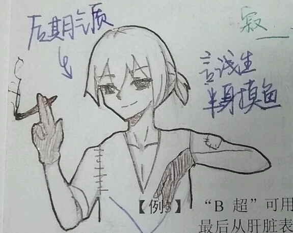

    “如果当时我能警惕一点，再多想一点，是不是就……”
    “恐怕不可能。我们的性格，就已经决定了我们的未来。”

***

“二十分钟内找到我。”

众人互相看了看。

“一定是大河又在变着法考我们，我们赶紧行动吧。”

狄斯澈的室友张潭清催促道，他一下子热血上涌，嚷着要和大河大战三百回合。

言浅生看了看大家，没有同其他人一样应和。

接着，一行人按照定下的计划开始行动，很快分布到楼里各个角落。

八分钟后，一个面容温和的男子出现在A座楼前小广场上，表情凝重。他缓缓吐出一口气，低头看了看自己手腕上的手表，慢慢走进大门。

两分钟后，二楼的箫月白无意中扫过正门门口，发现了抱着手臂靠在门口的男子。

三分钟后，十二人在男子周围集合，站定。

“还有五分钟，”张潭清看了看时间，兴奋地在男子面前拍着胸脯，“大河，我们赢了！”

大河扶了扶自己鼻梁上淡金色的细框眼镜，平和的目光透过镜片扫向众人，“太慢了，还要快。而且我也没躲。”

说罢他低头从兜里拿出手机，在上面滑了滑，“从明天开始，持续三天，任务：休息。不可进行与课程训练等相关的任何活动，娱乐活动不受限制。三天之后会有新任务，将在个人终端上进行推送。”

众人都是一愣。

个人终端说白了是一种庄园自主研发的类似现在的智能手表的电子设备，但是功能繁多强大，在任何情景下都可以使事情便利很多。在他们十岁正式分层之前，他们各种训练都包含个人终端的配戴利用，通知也大多在上面推送。分层之后学校给每人下发了手机，通知重心转到手机上，个人终端便逐渐淡出了课程和生活，但幼时的训练在脑海中留下的记忆却仍旧十分鲜明。个人终端十岁之后就没换代了，还是五年多前的老样子，突然启用实在是令人不解。

“没事的话现在去找你们秦老师更换个人终端，她在学校办公室。”大河没有抬头，只是挥了挥手让众人抓紧时间走。

大家满脸莫名其妙，但是不得对任务提出疑问已经是从小就被灌输的根深蒂固的概念，便一个个向外走去。

言浅生没有动，盯着大河欲言又止，似乎在等大河再说些什么。但是大河一直在看手机。

“我……我有事，”言浅生酝酿半天，终于掏出了自己的手机，“我没有收到那条短信。”

江晚铭迈动的脚步一滞。几个还在楼里的伙伴也停了下来，转头看向他们。

大河把目光挪向言浅生的手机，突然抖了抖肩膀，仿佛和看到了什么有趣的事一样。就在言浅生以为他要说出“哎呀，没想到我居然也能疏忽”或者“我换手机号了不小心把你的号删了”之类的话时，他却有点无奈的摇了摇头。

“你个孩子呀，还是不懂事啊……”大河摇着头，“既然没让你在二十分钟内找，又通知了你来A座，你就按照指示来，在外面等自己的通知啊。”

“他……跟我们不一样？”江晚铭问道。

这让几个人有点惊讶，一直以来这种集体性活动班级都是共进退的，有不同任务也是直接指派，几乎从来没有出现过这种情况。难道言浅生真的是大河的私生子？大河要让他休息六天，怕引起公愤才让自己留下单独说？大河年龄也不大啊，才三十多岁，据说这个年龄没结婚的都有呢，怎么儿子都这么大了。

“别瞎猜，言浅生留下的原因他自己应该不想说，”大河指着门口示意江晚铭几个快点走，“你们赶紧去找秦老师，别拖拉。”

几个人奇怪的看了言浅生一眼，陆续走了出去。

“……”言浅生眼神飘忽，没有去看江晚铭他们，内心十分地忐忑。

大河低头又滑了滑手机，然后抬头道：“你的个人终端一周前在你的申请下已经更换了，所以这次就不用换了。不过，你申请的原因是什么来着……？”

该来的总会来，我就知道事情不会那样简单。言浅生顿时心虚，硬着头皮道：“咳……那个我……拿它当手表用来着，整天带着磨损有点严重，你看它毕竟也是有一定年代了……这个有点磨损是正常的……”

“只是磨损有点严重？”大河又摇了摇头，“再怎么样你也要把谎话编得令人信服一点啊。你看看你那个个人终端，都裂了，你平时都在干什么能把它磨裂？我听说，你用它砸核桃不小心用力过猛导致的？”

“我……我不是我没有别瞎说……我……不喜欢吃核桃！”

“别狡辩。个人终端是有一阵不用了，但是没有废除的命令就说明迟早是有用的，你就这样糟蹋？当表用就算了，砸核桃是什么情况？又不是没有专门的工具……唉，你说说……”大河叹着气，似乎已经看到了言浅生不成器的未来，“下不为例，以后长点心。”

大河人看起来很有亲和力，所以大家都不怎么怕他。但他动不动就开始的语重心长的说教却令人十分崩溃。

言浅生只得点着头，不断地说“我错了下次再也不敢了”“老师你说的对”――毕竟是自己错了嘛……终于给熬过去了。

“所以没让你跟着去浪费时间，”大河结束了长篇大论，把手机向言浅生一递，“你看看这几个人。”

言浅生松了一口气，伸手接过手机，发现显示的是四个人的资料卡，三男一女，年龄大概在十八十九岁左右，看简介应该也是他们那一届分层后最优秀的一批的成员，也就是每一届的一班学生。

“仔细点看，他们也是一班的。他们这一届比较特殊，很多天赋能力都十分特殊且出众，对很多任务都特别有帮助。他们一班的学生一个个没能达到最佳状态就被分派了各种工作，现在只剩了这四个还在训练。三天之后你们班会见到他们四个，他们会暂时和你们待在一起，希望你们可以好好相处。”

听大河这么一说，言浅生就仔细看了看四个人的资料。

只见其中唯一的姑娘是琉璃，似乎在逻辑推理和推演设局方面十分出众，是智慧型人才，和綦宇天发展方向相似。看照片是一个栗色头发特别优雅有点像白黄混血的姐姐，言浅生看得心里怦怦跳。

另外三个男生分别是雷隐、林润和Joker。

雷隐是一个十分干练的大男孩，综合素质比较好，在各方面的速度尤为突出。言浅生自己也是所谓“速度型人才”，不过他觉得对于自己来说，这只能代表危险来临的时候自己逃跑的比较快。

林润却像是一个白面书生样的大哥哥，书生气息浓厚。带着圆框眼镜，文绉绉的，说话不带点文言文都对不起他的文青气质，一看就是博学多才的人。言浅生往下看资料，果然是学识型的。

Joker就不太一样了，他发色浅棕，眼睛是深蓝色的，五官立体，应该是白种人。照片里他留着帅气的刘海，戴着眼镜，笑的相当酷，却有点坏坏的气息。资料里注明他的武力型人才，不知跟江晚铭比起来谁高谁低，言浅生心里想着。Joker的眼神十分的明亮，并不像一个性格欠揍的家伙。

“这几个人你记住了就行。三天不要跟你班同学说任何有关这四个人的事，我看看你保守秘密的能力如何。”大河看言浅生看完了立马收回了手机。

“那我怎么跟他们解释你把我留下的事……总不能说我们在闲聊吧……”

言浅生捂住脸。就算告诉大家这四个学长学姐的事情也没啥说服力，大河单独留下他只是因为跟他介绍了几个人……这种事本来也很奇怪啊。但是他才不想说出自己个人终端的事……简直太傻了。

大河把手机放回兜里，对言浅生说：“自己想。你敢透露一毫，所有人的手机里都会收到你所有黑历史的记录。”

推送黑历史是大河作为一个从不发火的老师看管学生的拿手绝招。他似乎是早有准备，每个人的黑历史他不知通过什么手段都积累不少。

“哎……？？”

言浅生看着大河嘀咕着要买个靠垫关心一下自己的脊柱就转身走了，心里真是七上八下。这也太玄幻了吧……到底啥情况……

他看着大河的背影呆了一会，只好也转过身默默往外走。就在这一刹那，他感觉左耳一阵疾风掠过，他身子一个激灵，条件反射像右快速闪去。

可是紧接着，他感觉到喉咙一紧――有人捏住了他的脖子。

**＜困死……质量一次比一次差唉。＞**

情报公开: 言浅生正式立绘

