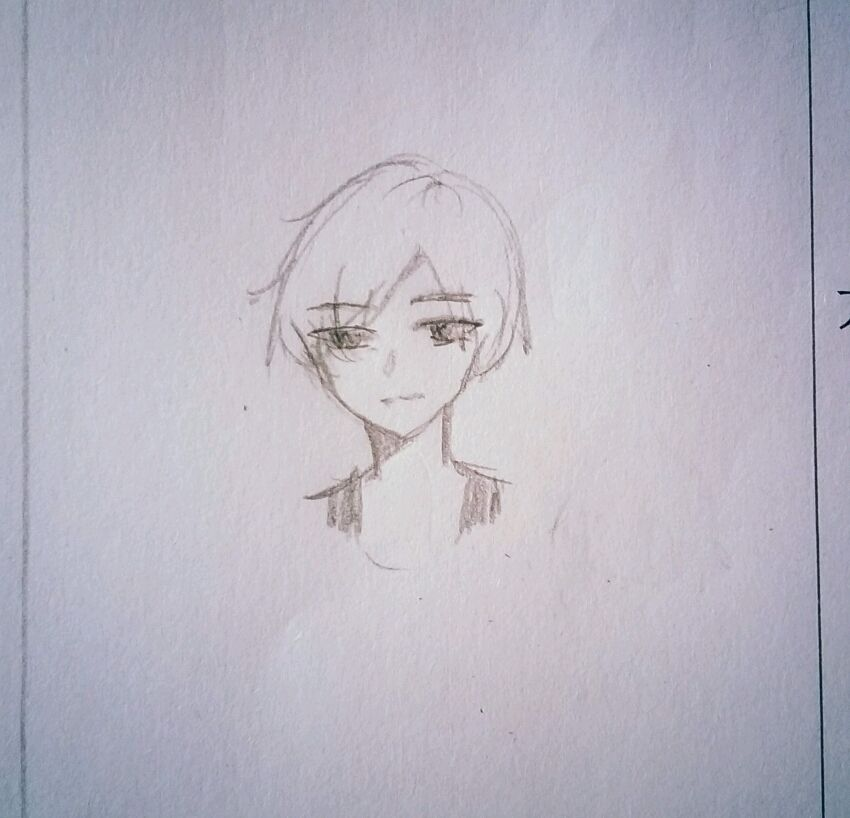

    “我们需要控制他最大的软肋。”
    “他最大的软肋是什么？”
    “你还不知道吗――早就有人观察出来了――他喜欢和他朝夕相处的那个人。”
    “喜欢？爱？”
    “嗯。”

***

言浅生心里想着事，脸上一副神游天外的表情，晃晃荡荡的往走着――他在习惯性的往住处走。

“啪嗒。”

脚下一颗石子突然绊了他一下，他踉跄几步，回头看到路边矮草摇晃，石子被他踢得滚了进去。

言浅生看着那团野草，眼睛在霎时警觉了起来。他看了看四周，回身低头拨开了草丛。他看到了那颗石子。

是一颗平淡无奇、普通、有着并不美观的棱角的白色石头，大约有半个手掌大。

言浅生停滞了几秒，迅速捡起了石子，然后转身冲着来的方向狂奔而去，带起的疾风在路两边的花草中以层层清晰波纹的形式显现着。

他在路上奔驰，衣角飞扬，手中紧紧攥着那块白色石子。

他要往哪里去。

言浅生自己也不是很清楚，但是他发现他的身体又一次为他做了决定――他正奔向学校和宿舍楼附近的一个小型树林。

这个林子是他平时经常去的地方。他之所以热衷于去树林里转悠大概是因为树林里最有生命的气息。那种每次呼吸都能真切感受到的生命的坚韧和精彩的感觉总是能让他暂时的忘掉一切。

“如果可以做一棵没有思想的植物就好了。”他有时会这样想。

几乎每次来，言浅生都是一个人。这个林子他十分熟悉，他知道有一些他认为别人难以找到的角落――他经常在那里呆很久。他把林子当作自己心灵的修复器，去那里温养自己的心情。而实际上，树林只是一个他用来逃避的避难所，他在这里感受到的美好只是因为贪图暂时的安逸。

言浅生的速度很快，不一会他就闪身进了树林，身影马上隐没在繁杂的枝干、粗大的气生根和条条垂下的藤蔓中。

周遭的环境一下子柔和了下来。人工林不如自然森林那么浓密，对光照的利用率也远远比不上，因此林子里并没有那种遮天蔽日、扑面而来的阴影。但是进入其中那一瞬依旧能够鲜明的感受到自然的盛大。

言浅生抬头看了看树冠，似乎在辨认树种。接着，他朝着一个方向走了一段距离，然后向右转绕过了一棵被寄生植物包裹的严严实实的半枯树木。他继续向前走，不时抬头看一下树冠，不定时的绕过几棵树，最后到了一棵非常没有特色的树前，唯一的特色大概就是丑。它长的非常没有规矩，大体是向上生长的，树干上的纹路却七扭八弯，表面粗糙有很多突起。看起来就像是有人把树融成了液体倾倒下去，液体在顷刻下流凝固而形成的奇怪模样。

言浅生将石头放进裤兜里，脚一蹬地，右手一挂树干上一个突起就向上窜起。接着双手上够挂住了一枝比较低的细树枝，腿向上缩，再踩助树干突起接力继续上蹿。如此这样，动作娴熟地爬到了树的上半段。

言浅生蹲在一枝还算结实的枝干上，向主枝干探头。在这个高度上，树的主干被挖了一个洞。往洞下看去，可以看到主干内部的水泥柱子的顶部。言浅生猜测是在这树还小时被从上而下地打入了这根水泥柱，但是树顽强的存活了下来，包裹着水泥柱向上生长，不知为何在顶部又长在了一起，因此造成了它充满褶皱的外表。

言浅生来林子非常喜欢爬树，有次无意中爬上了这棵发现了这个洞。只是这个洞是谁挖开呢？言浅生不得而知。

他将兜里的石头拿了出来，随手摘了几片叶子放入洞内，然后把石头压了上去。

做完这些，言浅生抓着树枝，脚蹬树干向下跳了几次下了树。他拍了拍自己的衣服，出了树林往宿舍楼走去。

这次他没有停留，一路哼着歌进了房间。

言浅生关上房间门，透过猫眼往外看了看，没有人，便转身走到自己的书桌前――他和江晚铭每人有一个很实用但是占地面积不大的小书桌。
他拉出中间一个抽屉，里面摞着不少各类的本子。言浅生蛮喜欢看书的，自己也开发了不少用来写各种奇怪东西的本子，包括一个类似日记本的本子。整个书桌他最看重的就是这个抽屉里的本子了，他从来没给别人看过。江晚铭知道他对这个抽屉十分看重，从来没有问过他相关问题。

言浅生从中间抽出挺厚的一本来，放到桌子上开始写东西。一边写，一边扭头看着门，像是入室行窃怕主人回来的小偷一样鬼鬼祟祟，又像瞒着父母偷玩手机的学生一样万分警惕。他写一会儿，翻几页，用了十几分钟的时间写到了本子有字的最后一页。

言浅生合上本子，重新将其放回抽屉中。因为回来时没有洗手就拿本子写东西了，因此手上的一些灰尘洒在了抽屉边缘。言浅生似乎有些不爽，干脆在自己放石头的裤兜里掏了掏，又捏了点灰弹在抽屉边上。

然后他慢慢推上了抽屉，去洗了手换了身衣服就倒在床上，拿起了走之前扔在床上的《山海经》开始看，只是书又一次被拿倒了。

“唉。”

言浅生叹了口气。他感觉自己像一个小丑一样，满脑子所谓的聪慧只是小聪明，处心积虑做的事也许在别人眼里一眼就能看穿，反而让人觉得十分滑稽。

但是不试试怎么知道呢……虽然进度似乎有点过快了，但是他等不了了。他想知道自己是不是在被监视，他急于想知道Joker的话的真实度。

言浅生无心看书，他又一次把《山海经》扔在了一边。抬眼看了看墙上的挂钟，快中午了，因为要更换个人终端而测数据的那些人大约该回来了。

正这么想着，门铃响了起来。

言浅生从床上跃起去开门，动作带着一丝忐忑和雀跃。

“回来了？”

“昂，数据测完了，大概明天就可以去拿了。这次新的个人终端非常强大啊，”江晚铭活动了一下手腕，表情却没有十分欣喜，

“大河跟你说了什么？为什么不给你更换个人终端？如果我们以后去野外实践万一发生了什么意外，你……”

话没说完，江晚铭愣了一下。因为言浅生堵在门口并没有让他进去的意思，眼睛还一眨不眨地盯着自己，眼神急切，嘴张了张欲言又止。

“你怎么了……要说什么事……？”

果然，在心中预演过再多遍也没用，这种话怎么能够对自己朝夕相处的兄弟说出口嘛……自己这个决定真的有点太过鲁莽，太过尴尬。但是自己目前能想到的也只有如此了。

言浅生在心里鼓励了自己一下，最终发现自己还是说不出口。

看着越发疑惑的江晚铭，言浅生一狠心，突然走上去抱住了江晚铭。

江晚铭一点都没躲避，被言浅生实实在在地抱了个正着，身体顿时僵了一下。

因为比江晚铭矮了半个脑袋，言浅生只好仰起头。他凑到江晚铭耳边，近到江晚铭能够感受到他的呼吸，不急促却有些紊乱――他在激动。

“你干什么……”

江晚铭没能问完便被耳边言浅生的低语打断。

**＜未审核。有点短，熬夜肝的。出乎意料，前面去树林那块莫名其妙的写的有点多，因此进度和我想像的不太一样，但是除了现在这个找不到更加合适的节点停止这章。所以更加扯淡的剧情在下一章｛预警｝。（我真的不是水剧情）然后请注意本文是正常向的，虽然可能有点扯淡。＞**
**＜最近丧失需要表达能力，全程流水账见谅。没写你们的设见谅。＞**

情报公开: 江晩铭发型

